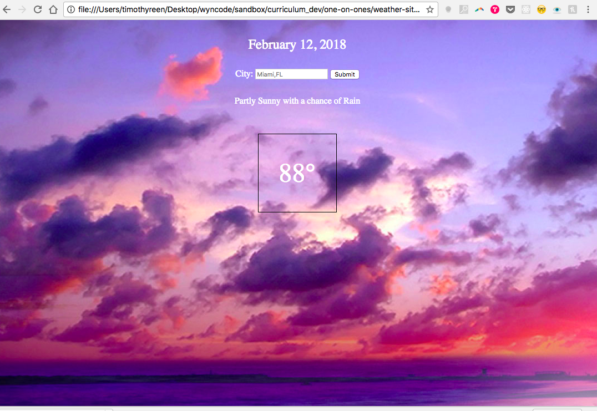

# HTML & CSS Coding Challenge

## Big Picture

Write enough HTML and CSS to get a browser to render the following content.

## Instructions

### Git

* [ ] Clone this repo and cd into it.
* [ ] Create an issue called "Create Weather Page" and assign it to yourself.  Assign it a label of "enhancement"
* [ ] Checkout a branch for your work with the naming convention `enhancement-(issue-number)-(your-name)-(issue-description)`

### HTML

* [ ] Write your code in the `index.html` file.
* [ ] Add a Page title.
* [ ] Put today's date in an h1 element.
* [ ] Make a form element (you can leave the form `action` set to the value `#`.
* [ ] Make a text input with a label that represents the city the user wants the weather for. (Give the input a placeholder value of "Miami").
* [ ] Make a button to submit the form. When the form submits, the url should change to say `?city=Miami` at the end, or whatever the user currently has typed into the input.
* [ ] Place the date, temperature, and description of the weather each in its own div element. _We don't need the page to be accurate. Just make up values_.

### CSS

* [ ] Create a CSS stylesheet and link it in the head of your HTML document.
* [ ] Make one of the three images in the `/images` folder the `background-image` of the body.  Use a class to accomplish this, so that if the weather changes, we could change the image by changing the class attribute of the body element.
* [ ] Center all text.
* [ ] Color all the text white.
* [ ] Make the temperature much larger than the rest of the text.
* [ ] Add a solid black border to the temperature div element.
* [ ] Give the temperature div a fixed width and center it, like in the image above.
* [ ] Add additional space above and below the temperature.
* [ ] Use a [sans-serif](https://en.wikipedia.org/wiki/Sans-serif) font for all text.
* [ ] Apply a media query to change the color of the temperature text when a user is viewing the site on a mobile device.

## Submitting

* [ ] Commit your work.
* [ ] Push your branch up to GitHub.
* [ ] Submit a pull request that will autoclose your issue.
# weathersite-
# weathersite-
